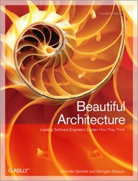



  

  
  

  

 
 

  

 

  

  

  

    

    

    
Welcome to my home page.

    
I am a researcher at the <a href="http://swerl.tudelft.nl/bin/view/Main/WebHome"> Software Engineering Research group </a>, <a href="http://www.tudelft.nl">TU Delft</a>.
            Before that, I got my PhD from the
            <a href="http://istlab.dmst.aueb.gr/sense">
              Software Engineering and Security laboratory</a>, at the
            <a href="http://www.aueb.gr">
              Athens University of Economics and Business</a>.

            
My primary research interests include:

            <ul>
              <li>Software engineering</li>
              <li>Programming Languages</li>
              <li>Systems software and system administration</li>
            </ul>

            
Projects I am working on

            <ul>
              <li>[Alitheia Core](http://www.sqo-oss.org): A platform for software engineering</li>
              research
              <li>Github-mirror: A suite of tools to process Github data</li>
            </ul>
      

      

            
      

    

    

      

            Together with Diomidis Spinellis, I worked on editing the
            Beautiful Architecture book.
            You can find more information from the publisher's
            <a href="http://oreilly.com/catalog/9780596517984/">book web site</a>. Beautiful Architecure has also been translated to Chinese (<a href="http://oreilly.com.cn/book.php?bn=978-7-111-28356-0">架构之美</a>), Japanese (<a href="http://www.oreilly.co.jp/books/9784873114309/">ビューティフルアーキテクチャ)</a> and Russian (<a href="http://www.ozon.ru/context/detail/id/5430638/">Идеальная архитектура</a>).
            If you buy it, you 're also helping a good cause, as the
            royalties as the royalties are donated to the [Medecins Sans Frontieres](http://www.msf.org/)
      

      

        
      

      

  

My Blog
-------
<ul class="posts">
  
    <li>{{ post.date | date_to_string }} &raquo; <a href="{{ BASE_PATH }}{{ post.url }}">{{ post.title }}</a></li>
  
</ul>

